过去两年里，“世界模型”（World Model）突然变成了 AI 领域最拥挤也最混乱的词之一。

视频生成公司说自己在做世界模型，自动驾驶公司说自己在做世界模型，机器人公司也说自己在做世界模型。游戏引擎、3D 生成、强化学习、VLA、视频扩散模型、JEPA、物理仿真，全都被塞进了同一个词里。结果是：每个人都在谈 world model，但很多时候谈的并不是同一件事。

这篇文章试图把它从头到尾讲清楚。我的目标不是写一个论文清单，而是写一篇 tutorial：如果你第一次接触这个方向，读完应该能回答三个问题：

1. world model 到底是什么，和 policy、VLA、仿真器、视频生成模型有什么区别？
2. 学术界为什么从 model-based RL、Dreamer、MuZero 一路走到 JEPA、Genie、Cosmos？
3. 工业界为什么会把 world model 视为具身智能、自动驾驶、机器人数据生成的下一代基础设施？

本文重点关注机器人、具身智能与自动驾驶语境。

> 注：本文由Claude Opus 4.7，ChatGPT5.5撰写，李阳编辑。

---

## 读完本文你应该得到什么

如果你是刚入学的 PhD，或者刚从强化学习、机器人、视觉生成某一个方向转过来，读完本文不需要记住所有论文名字，但应该建立一张 mental map：

```text
world model 不是一个单点技术
而是一组围绕“预测行动后果”的方法

RL 里的 world model       -> 学 dynamics，用于 planning / imagined training
视频生成里的 world model   -> 学未来视觉，用于生成、仿真和数据扩展
机器人里的 world model     -> 学 action-conditioned consequence，用于评估和控制
WAM                       -> 把 future state 和 future action 联合建模
```

更具体地说，你应该能分清四件事：

- **概念边界**：Sora、Dreamer、Cosmos、V-JEPA、OpenVLA、DreamZero 为什么都可能被放进同一场讨论，但它们解决的问题并不一样。
- **技术路线**：像素生成、latent prediction、结构化 dynamics、3D world、物理引擎各自适合什么。
- **机器人难点**：为什么真实机器人比游戏和自动驾驶更难，难在哪里。
- **入门路径**：第一步该读什么 repo、跑什么数据、做什么小实验，而不是一上来追大模型。

<figure>
  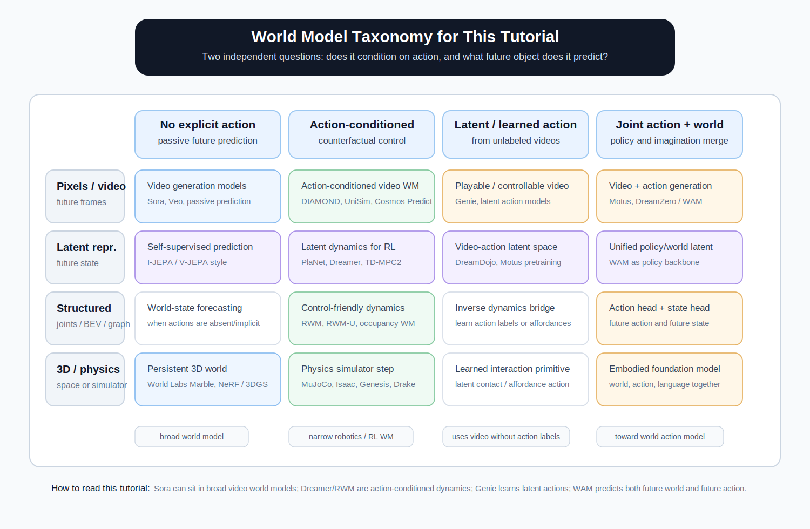
  <figcaption class="caption">本文使用的分类矩阵：横轴是动作条件，纵轴是预测对象。注意 action-conditioned 和视频生成不是互斥关系，UniSim、Cosmos Predict、DIAMOND 等都可以是 action-conditioned video world model。图：本文绘制。</figcaption>
</figure>

---

## 目录

- [1. 一句话定义：world model 是“可预测的环境”](#1-一句话定义world-model-是可预测的环境)
- [2. 为什么 world model 又火了](#2-为什么-world-model-又火了)
- [3. 广义世界模型与狭义世界模型](#3-广义世界模型与狭义世界模型)
- [4. 学术脉络：从 World Models 到 Foundation World Model 与 WAM](#4-学术脉络从-world-models-到-foundation-world-model-与-wam)
- [5. 今天的五条主流路线](#5-今天的五条主流路线)
- [6. 工业界在押什么](#6-工业界在押什么)
- [7. 机器人为什么比自动驾驶更难](#7-机器人为什么比自动驾驶更难)
- [8. 从 world model 到 world action model](#8-从-world-model-到-world-action-model)
- [9. 数据：world model 需要什么样的数据](#9-数据world-model-需要什么样的数据)
- [10. 真实部署：从 world model 到机器人系统](#10-真实部署从-world-model-到机器人系统)
- [11. 新手怎么入门：从代码、数据和实验开始](#11-新手怎么入门从代码数据和实验开始)
- [12. 读完以后该怎么选方向](#12-读完以后该怎么选方向)
- [一个总结](#一个总结)
- [术语表](#术语表)
- [References](#references)

---

## 1. 一句话定义：world model 是“可预测的环境”

最朴素的 world model 来自强化学习：

```text
current state + action  ->  next state
        s_t   +  a_t    ->  s_{t+1}
```

也就是说，智能体先观察当前状态 `s_t`，选择一个动作 `a_t`，world model 预测下一步状态 `s_{t+1}`。然后 policy 再根据新的状态选择动作，如此循环。

这听起来很简单，但它改变了智能体学习的方式。

没有 world model 时，智能体只能在真实环境里试错。机器人要真的伸手、真的碰撞、真的摔倒，自动驾驶车要真的开到某个边界场景里，游戏智能体也要真的跑完整局。这是 model-free learning 的基本模式。

有 world model 后，智能体可以先在模型里“想象”：

```text
如果我向左转，会不会撞？
如果我先推杯子再抓杯柄，杯子会怎么动？
如果前车急刹，我现在加速会发生什么？
```

所以 world model 的价值不是“生成一段好看的未来视频”，而是给 agent 一个内部环境，让它能在真实行动之前进行预测、规划、反事实推理和策略训练。

一个好用的 world model 至少应该带来三件事。

第一是采样效率。真实机器人采数据很贵，GPU 上 rollout 很便宜。能在模型里训练，就能把一部分真实交互成本转成计算成本。

第二是长程规划。VLA 或 diffusion policy 往往像“反射”：看见当前图像和指令，直接吐动作。world model 则允许 agent 先展开未来几步，比较不同动作序列的后果。

第三是可评估性。policy 说“我要这么做”，world model 可以告诉你“我预计这么做会发生什么”。这让反事实评估、安全过滤、失败分析都变得更自然。

---

## 2. 为什么 world model 又火了

world model 并不是新概念。2018 年 Ha 和 Schmidhuber 的论文就叫 *World Models*。更早的 model-based reinforcement learning 也一直在学环境动力学。

它现在重新变热，是因为三条技术线在 2024-2026 年交汇了。

第一，视频生成模型突然变强。Sora、Veo、Genie、Cosmos、World Labs 让大家看到，大规模视频模型不仅能生成漂亮画面，还可能学到某种空间结构、物体持久性和粗粒度物理规律。虽然“看起来对”和“物理上对”之间还有距离，但这已经足够让工业界开始认真投入。

第二，具身智能遇到了数据瓶颈。VLA 模型把视觉、语言、动作接在一起，已经能做很多机器人任务，但它依赖大量 teleoperation 数据。机器人数据比互联网文本和视频贵几个数量级。world model 提供了一个诱人的方向：能不能用互联网视频、仿真数据、人类第一视角视频和少量机器人数据，训练一个可交互的“内部模拟器”？

第三，自动驾驶已经证明“反事实仿真”有巨大价值。真实道路上的 corner case 很稀少，但安全系统恰恰要处理稀少事件。world model 可以生成或重放危险场景，帮助 planner 和 policy 做闭环评估。

所以今天的 world model 热潮，本质上不是单篇论文带来的，而是大模型、视频生成、机器人学习、自动驾驶仿真共同推出来的。

---

## 3. 广义世界模型与狭义世界模型

讨论 world model 前，必须先区分两个口径。

### 3.1 广义 world model

广义地说，只要模型能根据已有信息预测未来，都可以叫 world model。

语言模型预测下一个 token，可以说它学了一个文本世界模型。视频模型预测下一段视频，可以说它学了视觉世界模型。游戏模型根据玩家输入生成下一帧，也可以叫交互式世界模型。

按照这个口径，Sora、Veo、Genie、Cosmos、World Labs Marble 都可以被放进 world model 大伞下。

### 3.2 狭义 world model

在机器人和强化学习里，world model 通常有更窄的意思：它必须是 action-conditioned。

也就是说，它不只是预测“下一帧长什么样”，而是预测“我做了这个动作以后，世界会怎么变”：

```text
p(o_{t+1} | o_t, a_t)
```

这里 `o_t` 是当前观测，可以是图像、点云、关节状态、BEV occupancy 或 latent state；`a_t` 是动作，可以是键盘输入、车辆控制、机械臂末端位姿、关节角增量，也可以是一个自监督学出来的 latent action。

这一区别非常重要。被动视频预测可以用来看未来，但不一定能用于控制。机器人真正需要的是 counterfactual：如果我换一个动作，世界会怎样？

### 3.3 一个实用分类

我更喜欢用三个问题给 world model 分类：

**预测什么？**

- 像素：预测未来视频帧。
- latent：预测表征空间里的未来状态。
- 结构：预测物体、关节、occupancy、graph 或 keypoint 的变化。
- 动作：同时预测未来 action，变成 world action model。

**吃不吃动作？**

- 不吃动作：更像视频生成或未来预测。
- 吃动作：可以用于控制、规划和反事实推理。
- 自己学动作：从无标注视频中抽 latent action。

**服务什么？**

- 生成内容：视频、3D 世界、游戏环境。
- 评估策略：自动驾驶/机器人闭环仿真。
- 训练 policy：model-based RL、imagination rollout、数据生成。
- 理解物理：视觉表征、因果推断、常识推理。

用这个框架看，很多争论就消失了。Sora 可以是广义 world model，但不是机器人语境下完整的 action-conditioned dynamics model。Cosmos 更接近工业平台，因为它同时在做生成、预测、迁移和物理 AI 数据工具。V-JEPA 2 不生成像素，但它明确把世界状态放在表征空间里预测。

<figure>
  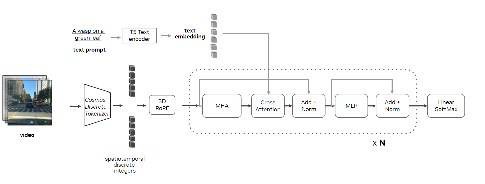
  <figcaption class="caption">生成式 world model 的一种工业形态：NVIDIA Cosmos 的自回归世界模型架构示意。它把视频 token、条件信息和未来预测放进统一生成流程中。图源：<a href="https://developer.nvidia.com/blog/advancing-physical-ai-with-nvidia-cosmos-world-foundation-model-platform/">NVIDIA Technical Blog</a>。</figcaption>
</figure>

---

## 4. 学术脉络：从 World Models 到 Foundation World Model 与 WAM

如果只讲到 JEPA，确实会漏掉最近两年最关键的变化。更准确的脉络应该是：

```text
小规模 latent dynamics
    -> 面向控制的 model-based RL
    -> 隐式 value/policy dynamics
    -> Transformer / diffusion 视频世界模型
    -> JEPA 式非生成表征预测
    -> foundation world model
    -> robot world model / world action model
```

下面先按时间线给一张速览表，再展开每个阶段。

| 阶段 | 代表论文 / 系统 | 核心问题 |
|---|---|---|
| 2018 | *World Models* | 能不能在模型“梦境”中训练 agent |
| 2019-2023 | PlaNet, Dreamer V1/V2/V3 | 从像素学 latent dynamics，并在想象 rollout 里学 policy |
| 2020-2024 | MuZero, EfficientZero, TD-MPC2 | 不必重建像素，只预测 reward/value/policy 或控制相关状态 |
| 2023-2024 | IRIS, STORM, DIAMOND | Transformer / diffusion 进入 world model |
| 2023-2025 | I-JEPA, V-JEPA, V-JEPA 2 | 不预测像素，预测语义/物理表征 |
| 2024-2025 | Genie, UniSim, Cosmos, Marble | 世界模型变成可交互/可生成/可产品化的基础模型 |
| 2025 | Robotic World Model, RWM-U | 机器人控制里解决 long-horizon drift 与不确定性 |
| 2025-2026 | Motus, DreamDojo, DreamZero | 从 world model 走向 world action model，同步建模视频和动作 |

<figure>
  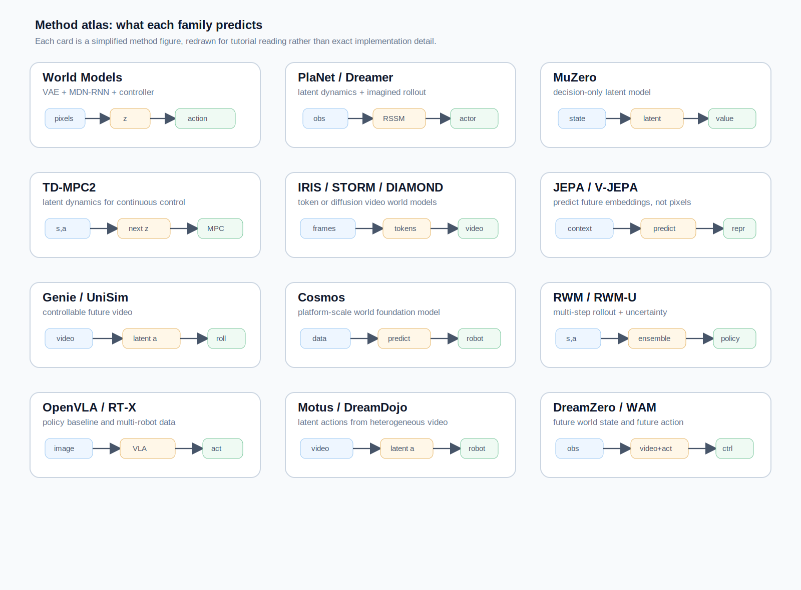
  <figcaption class="caption">方法速览图：每张小卡片都对应一个论文/方法族的核心预测目标。它不是精确复刻论文架构，而是帮助你读正文时先抓住“输入是什么、模型预测什么、下游怎么用”。图：本文根据各论文/项目方法重绘。</figcaption>
</figure>

### 4.1 Ha & Schmidhuber：在梦里训练 agent

2018 年的 *World Models* 是这个方向最有名的起点之一。

它把 agent 拆成三块：

```text
V: Vision model
   把像素压成 latent z

M: Memory / dynamics model
   用 RNN 在 latent 空间里预测未来

C: Controller
   根据 latent 和 hidden state 输出 action
```

核心想法很漂亮：先用真实环境数据训练 V 和 M，然后冻结它们，让 controller 在模型生成的“梦境”里训练。最后把 controller 拿到真实环境中执行。

这篇论文的意义不是性能有多强，而是它清楚展示了一个范式：

```text
先学习世界，再学习行动。
```

<figure>
  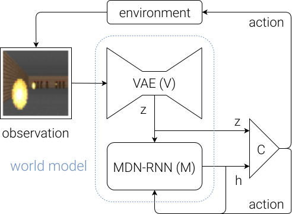
  <figcaption class="caption">Ha &amp; Schmidhuber 的经典 World Models 框架：Vision model 把像素压到 latent，Memory model 在 latent 空间里预测未来，Controller 在这个内部世界里学习动作。图源：<a href="https://worldmodels.github.io/">World Models project page</a>。</figcaption>
</figure>

### 4.2 PlaNet 与 Dreamer：latent dynamics 成为主线

DeepMind 的 PlaNet 和 Dreamer 系列把这个思想工程化。

PlaNet 用 Recurrent State-Space Model（RSSM）从像素学 latent dynamics，然后在 latent 空间里做 planning。Dreamer 进一步把 planning 改成 actor-critic：在 imagined rollout 里训练 policy。

Dreamer 的核心结构可以理解成：

```text
真实经验 -> encoder/RSSM -> latent rollout -> reward/value/continue prediction
                                      |
                                      v
                                  actor-critic
```

<figure>
  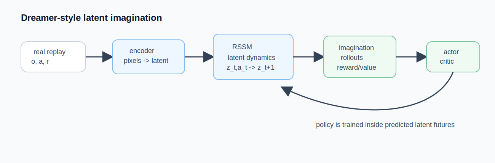
  <figcaption class="caption">Dreamer 系列的核心 method 图：从真实 replay 中学 RSSM latent dynamics，然后在 latent imagination rollout 里训练 actor-critic。图：本文根据 PlaNet/Dreamer 系列方法重绘。</figcaption>
</figure>

它的关键不是重建漂亮画面，而是让 latent space 对控制有用。Dreamer V2 用离散 latent 在 Atari 上取得强结果，Dreamer V3 强调“一套超参数跨大量任务”，成为 model-based RL 里最重要的基线之一。

### 4.3 MuZero：不重建世界，只预测对决策有用的量

MuZero 是另一条路线。

它不要求模型重建像素，也不要求 latent state 有人能解释。它只要求模型在搜索展开时预测三件事：

```text
reward
value
policy prior
```

只要这三个头对，latent 长什么样都可以。

<figure>
  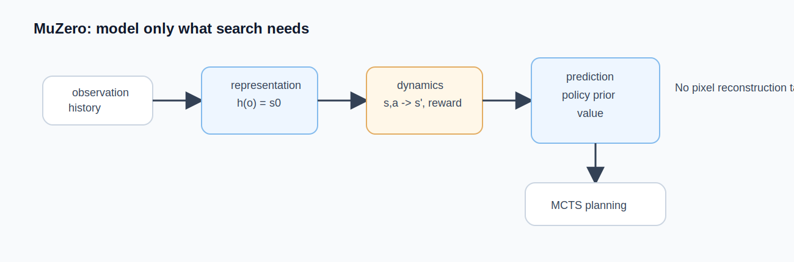
  <figcaption class="caption">MuZero 的 method 图：representation network 把观测历史变成 latent state，dynamics network 在 latent 里展开，prediction network 输出 policy prior/value。它不要求重建像素，只要求对搜索和决策有用。图：本文根据 MuZero 方法重绘。</figcaption>
</figure>

这给 world model 一个很重要的启发：对 agent 来说，“真实地还原世界”不一定是最优目标。更高效的目标可能是“预测和决策有关的未来”。

### 4.4 Transformer 与 diffusion：视频模型进入 world model

IRIS、STORM、DIAMOND 等工作把 Transformer、VQ tokenizer、diffusion 带进 world model。

IRIS 把 Atari 图像离散成 token，然后用 GPT 风格的 Transformer 做 next-token prediction。DIAMOND 则用扩散模型做像素级 world model，在第一人称游戏环境里生成可玩的未来画面。

从这里开始，world model 和视频生成模型越来越接近。

### 4.5 JEPA：不要预测像素，预测表征

Yann LeCun 长期推动 JEPA（Joint-Embedding Predictive Architecture）路线。

JEPA 的直觉是：像素空间里有太多无关细节。光照、纹理、阴影、噪声、背景变化，很多东西对“理解物理”和“做决策”没有帮助。如果模型花大量容量去生成这些细节，反而会浪费学习能力。

所以 JEPA 不预测像素，而是在表征空间预测未来：

```text
visible context -> predictor -> future representation
                                  |
                                  v
                         match encoder(future observation)
```

I-JEPA 从图像开始，V-JEPA 推到视频，V-JEPA 2 进一步强调物理理解、预测和机器人规划。Meta 对 V-JEPA 2 的定位很明确：它是通向 Advanced Machine Intelligence 的 world model 组件，而不是一个视频生成器。

<figure>
  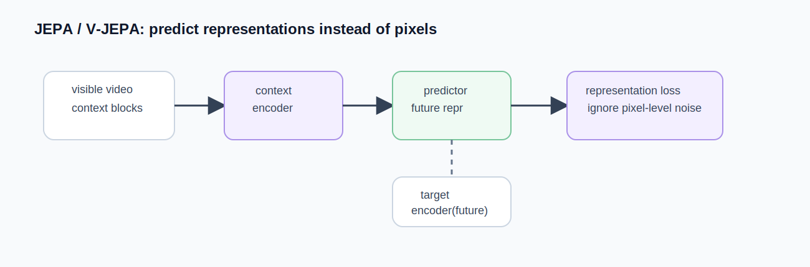
  <figcaption class="caption">JEPA / V-JEPA 的 method 图：模型不去生成未来像素，而是让 context encoder 和 predictor 去匹配 future observation 的表征。这样训练目标更聚焦语义、几何和物理状态。图：本文根据 JEPA / V-JEPA 方法重绘。</figcaption>
</figure>

这条路线和 Sora/Cosmos/Genie 的差异很根本：生成式路线问“下一帧长什么样”，JEPA 路线问“下一步世界状态怎么变”。

### 4.6 Genie / UniSim / Cosmos：world model 变成 foundation model

2024 之后，world model 的重心从“某个 RL 环境里的 dynamics model”快速转向“大规模可交互世界基础模型”。

Genie 是这一波的关键节点。Genie 1 从无标注 2D 平台游戏视频里学习 latent action，让静态图片变成可交互环境。Genie 2 进一步提出 large-scale foundation world model：给一张图，就能生成可被人类或 agent 操作的 3D 环境。它的意义不是游戏本身，而是把 world model 变成 agent 的训练场。

UniSim 则把互联网视频、机器人数据、游戏和导航数据统一到一个可控视频预测框架里。它说明了一个重要方向：不同来源的数据虽然 action space 不同，但都可以转成“当前观测 + 条件 -> 未来观测”的问题。

<figure>
  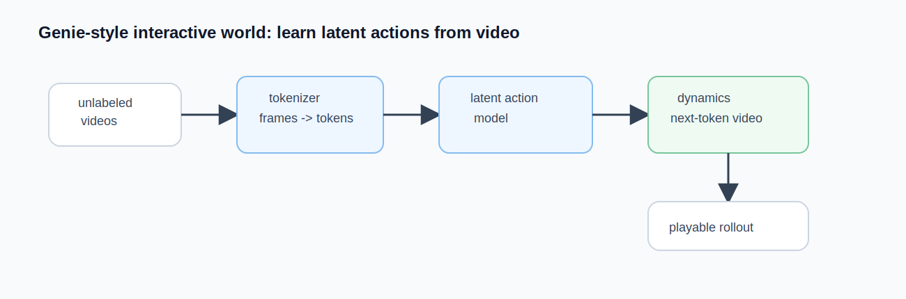
  <figcaption class="caption">Genie / UniSim 类方法的关键：从无动作标签视频中学 latent action，再用 latent action 条件化未来视频生成，使模型从“被动视频预测”走向“可交互世界”。图：本文根据 Genie / UniSim 方法重绘。</figcaption>
</figure>

<figure>
  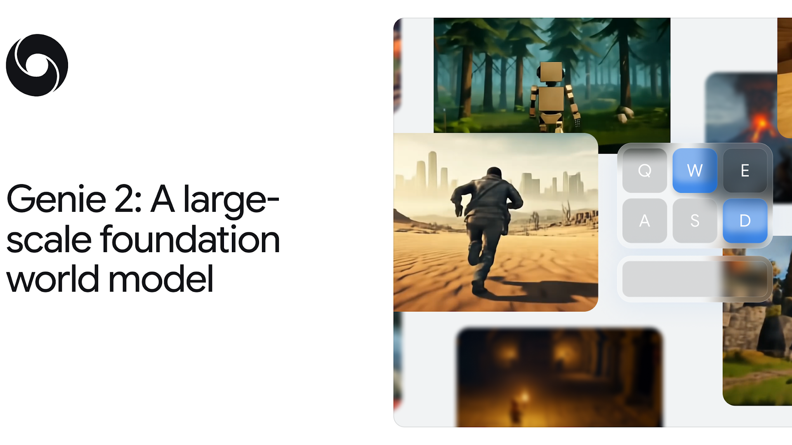
  <figcaption class="caption">Genie 2 的结果示意：从单张输入图像生成可交互 3D 世界，强调的是“可被 agent 操作的环境”，而不只是单段视频。图源：<a href="https://deepmind.google/discover/blog/genie-2-a-large-scale-foundation-world-model/">Google DeepMind Genie 2 blog</a>。</figcaption>
</figure>

Cosmos 更像工业版答案。NVIDIA 把 world model 做成平台：Cosmos Predict 负责未来视频预测，Cosmos Transfer 负责风格/域迁移，Cosmos Reason 负责物理 AI 推理，再接 Isaac、Omniverse 和 GR00T。这里 world model 不再是单篇论文里的模块，而是机器人和自动驾驶数据工厂的一部分。

World Labs Marble 代表另一条 foundation world model：不是生成一段视频，而是生成持久、可导航、可编辑、可导出的 3D world。它补上的是视频模型最弱的空间一致性。

### 4.7 Robotic World Model / RWM-U：回到机器人控制的硬问题

大视频模型很吸引眼球，但机器人控制里还有一类更“硬”的 world model：state-based dynamics model。

Robotic World Model（RWM）关注的是如何把 learned simulator 真正用于机器人 policy optimization。它不追求生成漂亮视频，而是要解决两个老问题：

```text
long-horizon rollout 不发散
policy 不利用模型误差
```

RWM 的核心在于多步自回归训练，让模型在训练阶段就面对自己的预测误差。RWM-U 进一步加入 ensemble uncertainty，用多个预测头估计 epistemic uncertainty。policy 在模型里训练时，对高不确定性区域加惩罚，避免跑进模型没见过、但奖励看起来很高的“幻想区域”。

<figure>
  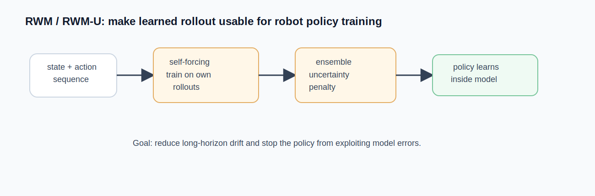
  <figcaption class="caption">Robotic World Model / RWM-U 的 method 图：多步 self-forcing 缓解 rollout drift，ensemble uncertainty 告诉 policy 哪些预测区域不可靠。图：本文根据 RWM / RWM-U 方法重绘。</figcaption>
</figure>

这条线的重要性在于：它把 world model 从“生成未来”拉回到“能不能训练出真实可部署的 policy”。对 locomotion、manipulation 这类任务，可靠性比视觉效果更重要。

### 4.8 Motus / DreamDojo / DreamZero：从 world model 到 world action model

2025-2026 年最新的一批工作，已经不满足于只预测 state，而是开始把 video、action、language、policy 放进一个统一模型里。

Motus 提出 unified latent action world model，用一个框架同时做：

```text
video generation
world modeling
inverse dynamics
action prediction
video-action joint prediction
```

它的关键是 latent action：先用可扩展的方式从异构视频中抽取动作表征，再让理解、视频生成和动作模块在 joint attention 中对齐。Motus 的意义在于把原来分裂的 VGM、IDM、WM、VLA 放到一个统一生成框架里。

DreamDojo 更偏 foundation robot world model。它用大规模第一视角人类视频预训练，通过 continuous latent actions 解决无动作标签的问题，再在目标机器人数据上 post-train。它强调 contact-rich、dexterous task 的可控模拟，并通过蒸馏把交互速度推到实时附近。

DreamZero 则把这个思想推到 policy 端。它提出 World Action Model（WAM）：基于预训练 video diffusion backbone，同时预测未来世界状态和机器人动作。相比 VLA 只做 action regression，WAM 用视频作为 dense supervision，让模型学习物理运动和动作后果。DreamZero 的一个标志性结果是把 14B 自回归视频扩散模型优化到闭环控制频率，并在新任务、新环境和跨 embodiment 上显示出比传统 VLA 更强的泛化。

<figure>
  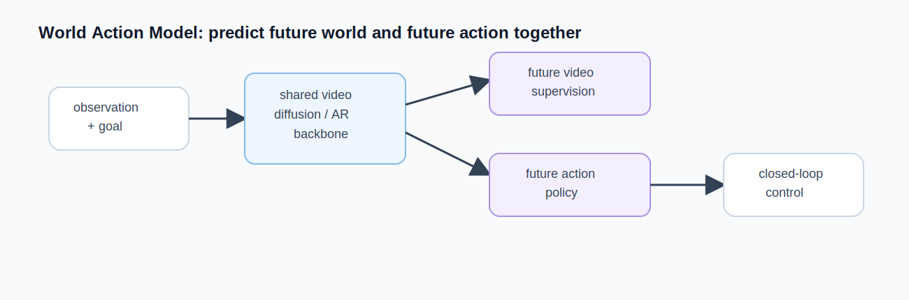
  <figcaption class="caption">World Action Model 的 method 图：同一个 backbone 同时预测未来视频和未来动作。视频提供 dense physical supervision，动作头把这种“想象”接回闭环控制。图：本文根据 WAM / DreamZero / Motus 类方法重绘。</figcaption>
</figure>

这批论文说明了一个新趋势：world model 不再只是 policy 旁边的 simulator，而是 policy 本身的一部分。

```text
过去：policy 使用 world model
现在：world model 和 policy 联合建模
未来：agent 的“想象”和“行动”可能是同一个模型的不同推理模式
```

---

## 5. 今天的五条主流路线

### 5.1 视频生成路线：预测“下一帧长什么样”

代表：Sora、Veo、Genie、Cosmos Predict、UniSim、DIAMOND。

这条路线把未来表示成视频帧。输入当前帧、文本、动作或历史视频，输出未来视频。

它的赌注是：物理规律可以从大规模视频数据中涌现出来。只要数据足够多、模型足够大，模型会自动学到物体持久性、遮挡关系、碰撞、流体、光照和运动模式。

优点很明显：数据规模最大，训练目标直观，生成结果可视化，容易给产品和投资人展示。

缺点也很明显：长时序会漂移，物理细节不稳定，低延迟控制困难。机器人抓取、接触、软体形变、力反馈这些问题，靠“看起来像”远远不够。

这条路线最适合做三类事：

- 生成训练数据。
- 做策略评估和反事实场景。
- 给 high-level planner 提供未来想象。

### 5.2 JEPA / latent prediction 路线：预测“世界状态怎么变”

代表：I-JEPA、V-JEPA、V-JEPA 2、LeCun 的 AMI 蓝图。

这条路线不追求生成漂亮图像，而是在 latent space 里学习世界的变化。它更像“理解模型”而不是“生成模型”。

优点是表征紧凑、训练目标更贴近语义和物理、推理可能更快。缺点是可视化不直观，很难像视频模型那样直接展示一段未来结果。

如果你关心基础研究、表征学习、物理理解、机器人规划，JEPA 是非常值得读的路线。

### 5.3 结构化 dynamics 路线：预测“物体和状态变量怎么变”

代表：Dreamer、TD-MPC2、Robotic World Model、state-based locomotion models、occupancy world models。

这条路线直接在状态空间建模。状态可以是机器人关节、本体感知、物体 keypoints、BEV occupancy、voxel grid 或图结构。

它的优点是控制友好、速度快、可以用于高频闭环。比如 locomotion 需要 50Hz 甚至更高频率，像素视频模型很难直接进控制环，state-based world model 更实用。

缺点是需要更强的状态设计和归纳偏置。它不如互联网视频路线 scalable，但在具体机器人和自动驾驶系统里可能更可靠。

### 5.4 3D 空间理解路线：生成“可持久存在的三维世界”

代表：World Labs Marble、3D Gaussian Splatting / NeRF 系列、空间智能方向。

这条路线关心的不是下一帧，而是一个可导航、可编辑、可导出的 3D 世界。可以把它理解成“从视频或多模态输入重建持久 3D 世界”。

它解决的是视频模型最不擅长的问题：空间一致性。一个物体绕一圈回来还在原处，房间结构不会突然变，光照和几何关系保持稳定。

这条路线对游戏、影视、VR/AR、数字孪生、机器人仿真都有意义。但它和机器人控制中的 world model 还差一步：摄像机移动不是机器人动作，渲染新视角也不等于模拟机器人和物体交互。

### 5.5 物理引擎路线：让 Newton 来当 world model

代表：MuJoCo、Isaac Sim / Isaac Lab、Genesis、Drake。

这条路线的世界模型不是神经网络，而是物理引擎。给定状态和动作，物理引擎直接算下一状态。

优点是物理正确性强，尤其适合刚体、碰撞、接触、locomotion。缺点是 asset、材料、接触参数、传感器噪声、现实世界多样性很难完全建好。

未来很可能不是“神经 world model 替代物理引擎”，而是两者耦合：

```text
物理引擎提供可控、精确、可并行的底座
生成模型提供场景、物体、纹理、扰动和 domain randomization
world foundation model 提供仿真到真实的迁移和数据扩展
```

---

## 6. 工业界在押什么

从工业界看，world model 不只是一个研究方向，而是一种基础设施竞争。

### 6.1 NVIDIA Cosmos：物理 AI 的平台化路线

NVIDIA Cosmos 是目前最典型的工业平台路线。NVIDIA 把它定义为面向 physical AI 的 world foundation model 平台，包含 world generation、video data processing、evaluation 和 post-training 工具。

Cosmos 的关键不只是模型，而是生态：

```text
Cosmos Predict   -> 预测/生成未来视频世界
Cosmos Transfer  -> 仿真到真实、风格迁移、多控制生成
Cosmos Reason    -> 物理 AI 推理与高层理解
Omniverse/Isaac  -> 仿真、数据生成、机器人训练
GR00T            -> 人形机器人策略
```

这就是为什么 Cosmos 值得重点关注：它不只是一个模型，而是一个完整的工程平台。对算法工程师来说，平台化意味着你的贡献可以落到视频生成、多模态理解、物理仿真、CUDA 优化、机器人数据生成、自动驾驶评测等多个可见模块上。

<figure>
  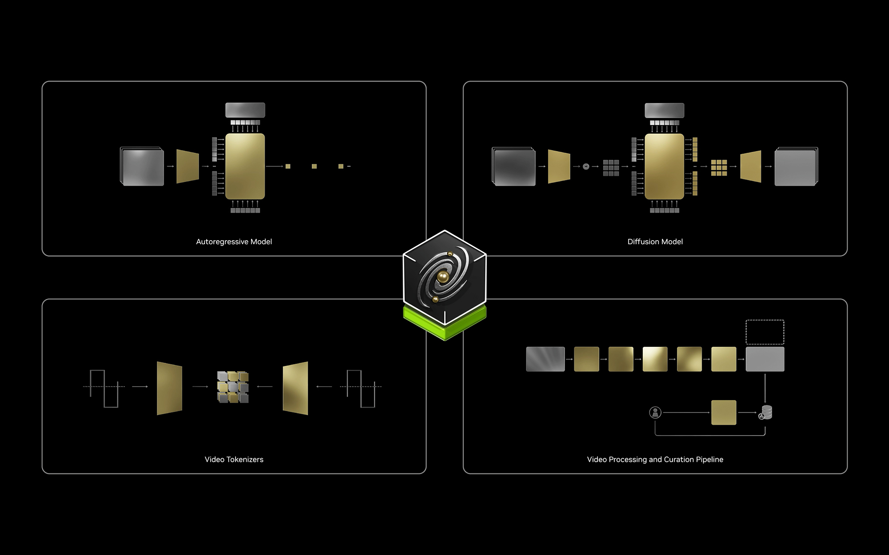
  <figcaption class="caption">Cosmos 的重点不是单个视频模型，而是 physical AI 数据、生成、评测和后训练平台。图源：<a href="https://developer.nvidia.com/blog/advancing-physical-ai-with-nvidia-cosmos-world-foundation-model-platform/">NVIDIA Technical Blog</a>。</figcaption>
</figure>

### 6.2 Google DeepMind Genie：可交互世界作为 agent 训练场

Genie 系列的核心是 generative interactive environments。

Genie 1 从无标注互联网视频中学习可控环境，并通过 latent action model 让用户逐帧交互。Genie 2 进一步定位为 large-scale foundation world model，可以从单张 prompt image 生成可被人或 AI agent 操作的 3D 环境。

它的工业意义不只是“生成游戏画面”，而是给未来 general agents 提供训练与评估环境。

如果一个 world model 能生成无限多可交互环境，那么 agent 就可以在虚拟世界里训练、犯错、探索，再把能力迁移到真实世界。这是 DeepMind 长期关心的路线：游戏和虚拟环境不是终点，而是通向通用智能的训练场。

### 6.3 World Labs：空间智能与 3D 世界生成

World Labs 走的是空间智能路线。Marble 的目标是从文本、图像、视频或粗 3D layout 生成可探索、可编辑、可导出的 3D worlds。

它和视频生成路线的不同点在于：视频是一段时间序列，3D 世界是一个持久空间。对于游戏、影视、建筑、VR/AR、机器人仿真，持久空间比单段视频更有用。

纯视频生成已经非常拥挤，但“生成可持久、可导航、可导出的 3D 世界”仍然是早期战场。World Labs 的意义就在这里：它把 world model 从时间序列视频推向空间智能。

### 6.4 Meta FAIR / AMI：非生成式世界模型

Meta 的 V-JEPA 2 代表另一种工业研究路线：不把世界模型等同于视频生成，而是让模型学习物理世界的表征和预测。

这条路线短期内不如视频生成好展示，但基础研究味道更重。如果你关心自监督学习、视觉表征、物理常识、zero-shot robot planning，它可能比生成式路线更接近“理解世界”的本质问题。

### 6.5 自动驾驶公司：闭环评测和反事实仿真

Wayve、Tesla、Waymo、NVIDIA Drive、国内的理想/小鹏/华为/蔚来/上海 AI Lab/OpenDriveLab 等，都在不同程度上做 world model 或 scenario generation。

自动驾驶里的 world model 往往有几个特点：

- 多摄像头或 BEV 表示。
- action space 相对简单，主要是轨迹、转向、加速度。
- 重点是闭环评测、安全验证、corner case 生成。
- 可以和已有仿真器、地图、occupancy、planner 结合。

这也是为什么自动驾驶 world model 通常比机器人 world model 先成熟一步：数据更多，动作简单，物理接触更少。

### 6.6 机器人公司：world model 作为数据工厂

机器人领域的工业目标更直接：用 world model 生成数据、评估策略、训练 policy。

1X、Physical Intelligence、Figure、Agility、Skild、NVIDIA GR00T、国内的智元、银河通用、星动纪元、宇树、极佳视界、蚂蚁灵波等团队，都在不同角度探索这件事。

机器人领域最值得关注的是“具身控制路线”，也就是：

```text
world model + VLA + reinforcement learning
```

让机器人先在虚拟世界里学，再把能力迁移到真实工厂或家庭。这可能是 world model 最终商业价值最大的地方，但也是技术难度最高的地方。

---

## 7. 机器人为什么比自动驾驶更难

自动驾驶已经很难，但从 world model 角度看，机器人更难。

自动驾驶的动作空间相对低维。车主要控制方向盘、油门、刹车，本质上可以抽象成轨迹规划。机器人则可能有几十个关节，机械臂、夹爪、人形、四足的 embodiment 完全不同。

自动驾驶不希望发生接触。车要避免撞人、撞车、撞路障。机器人恰恰必须接触世界：抓杯子、推抽屉、拧瓶盖、折毛巾、开门、插线、端盘子。接触动力学、摩擦、软体形变、遮挡、力反馈，全是难点。

自动驾驶场景结构相对规范。道路、车道线、交通灯、车辆、行人都有较强规律。家庭和工厂里的机器人环境更开放，物体形状、材质、摆放方式和任务目标变化巨大。

还有控制频率问题。

Manipulation 任务有时可以低频规划，比如 1Hz 到几 Hz，模型可以先生成候选未来再选动作。Locomotion 则需要高频闭环，50Hz 甚至更高。此时视频 world model 太慢，必须用 state-based dynamics、policy distillation 或小模型。

因此机器人 world model 的最终形态很可能是分层的：

```text
高层：视频/语言/3D world model，用来想象任务和规划子目标
中层：action-conditioned dynamics，用来评估动作序列
低层：快速 policy 或 MPC，用来闭环控制
底层：真实传感器、力反馈、触觉和安全控制
```

---

## 8. 从 world model 到 world action model

传统 world model 预测未来 state：

```text
state + action -> future state
```

VLA 预测 action：

```text
observation + language -> action
```

World Action Model（WAM）试图把两者统一起来：同一个模型既能预测未来世界，也能预测未来动作。

可以把相关模型放在一个表里：

| 模型类型 | 条件 | 输出 | 例子 |
|---|---|---|---|
| Video Generation Model | 当前/历史视频、文本 | 未来视频 | Sora、Veo、Cosmos Predict |
| World Model | 当前状态、动作 | 未来状态 | Dreamer、TD-MPC、action-conditioned video model |
| Inverse Dynamics Model | 当前状态、未来状态 | 动作 | UniPi 类 video-to-action |
| VLA / Policy | 图像、语言、本体状态 | 动作 | RT-2、OpenVLA、π0、GR00T |
| World Action Model | 视频、动作、语言联合条件 | 未来视频和未来动作 | DreamZero、Motus 类路线 |

统一建模的吸引力在于：视频和动作本来就是同一个物理过程的两个侧面。

如果我知道当前帧和动作，我可以预测下一帧；如果我知道当前帧和下一帧，我也可以反推动作；如果我知道任务目标和当前观测，我可以生成动作；如果我知道动作计划，我可以生成执行视频。

WAM 的目标是让一个模型支持这些模式：

```text
forward dynamics:      o_t, a_t -> o_{t+1}
inverse dynamics:      o_t, o_{t+1} -> a_t
policy:                o_t, language -> a_t
video planning:        o_t, language -> o_{t+1:T}
joint imagination:     o_t -> future video + future actions
```

它的难点也很明显：训练复杂、数据异构、动作空间不统一、视频生成和 action prediction 会互相干扰。短期看它比单纯 VLA 难很多；长期看，它可能是更自然的具身智能基座。

---

## 9. 数据：world model 需要什么样的数据

讨论 world model 的数据时，先不要急着列数据集。更重要的问题是：模型到底要学什么条件分布？

对 VLA / imitation policy 来说，核心数据通常是：

```text
observation + language -> action
```

它最需要的是高质量 expert demo：成功、干净、任务明确，能告诉 policy “这个状态下应该怎么做”。

对狭义 world model 来说，核心数据是：

```text
observation + action -> next observation / next state
```

它需要的不只是成功轨迹，还需要失败、试探、碰撞、滑动、卡住、恢复、慢动作、快动作、不同风格的交互。原因很简单：world model 要知道“做什么会发生什么”，而不只是“怎么做对”。

对 WAM 来说，数据还要再多一层：

```text
observation + language -> future action + future observation
```

也就是说，WAM 既要像 policy 一样理解任务目标和动作，又要像 world model 一样理解动作后果。

### 9.1 数据金字塔

一个实用的数据金字塔可以这样理解：

```text
Level 1: Web video / image / text
         最大规模，最便宜，但没有机器人动作标签。

Level 2: Egocentric human video
         第一视角人类行为，接近具身交互，但动作不是机器人 action。

Level 3: Simulation data
         有状态、有动作、有可控扰动，适合做最小闭环实验。

Level 4: Task-agnostic robot play
         机器人自由探索，覆盖失败、恢复和动作后果。

Level 5: Multi-robot trajectories
         不同 embodiment 的观测和动作，适合研究泛化。

Level 6: Target robot expert data
         最干净、最贵，用于最后适配和评测。
```

这里的关键不是“play data 一定比 expert demo 好”，而是二者服务的目标不同。expert demo 更像答案；play data 更像物理实验记录。训练 policy 需要答案，训练 world model 需要实验记录。

这也解释了 latent action 的重要性。互联网视频和人类视频没有机器人 action label，但相邻帧之间隐含了某种动作或意图。模型如果能自监督抽取 latent action，就能把无标注视频变成更接近 world model 训练的数据。

<figure>
  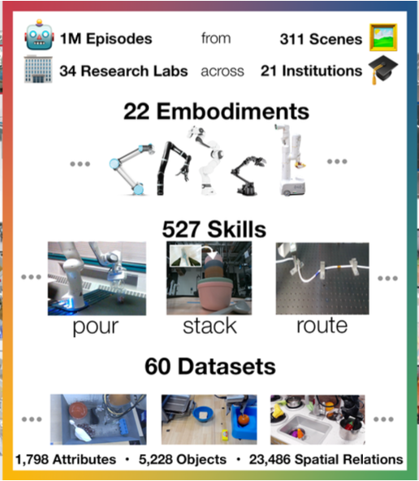
  <figcaption class="caption">真实机器人数据最宝贵的地方不只是“视频”，而是视频、动作、本体状态、语言和 embodiment 的对齐。Open X-Embodiment 展示了多机器人数据为什么会成为 VLA/WAM 的基础设施。图源：<a href="https://robotics-transformer-x.github.io/">Open X-Embodiment / RT-X project page</a>。</figcaption>
</figure>

### 9.2 常用数据集：从哪里开始

可以按“离机器人控制有多近”来选数据：

| 数据集 / 来源 | 适合学什么 | Link | 图片 / 视频入口 | 优点 | 局限 |
|---|---|---|---|---|---|
| Dreamer / TD-MPC2 online replay | model-based RL 基本闭环 | [DreamerV3](https://github.com/danijar/dreamerv3), [TD-MPC2](https://github.com/nicklashansen/tdmpc2) | repo 日志里的 replay / video summary | 不用下载大数据，环境交互自动产生数据 | 主要是仿真，不是真实机器人数据 |
| D4RL / Minari D4RL | offline dynamics、offline RL | [D4RL GitHub](https://github.com/Farama-Foundation/D4RL), [Minari D4RL](https://minari.farama.org/datasets/D4RL/index.html) | 环境 rollout 可自行渲染 | 小而经典，适合调试算法 | 机器人视觉和多模态信息较少 |
| Meta-World | manipulation world model | [Project](https://meta-world.github.io/), [GitHub](https://github.com/Farama-Foundation/Metaworld) | [project page demos](https://meta-world.github.io/) | 50 个桌面 manipulation 任务，适合多任务 RL | MuJoCo 仿真，视觉和真实数据有限 |
| ManiSkill | manipulation / mobile manipulation / dexterous tasks | [Docs](https://maniskill.readthedocs.io/en/latest/tasks/index.html), [GitHub](https://github.com/haosulab/ManiSkill) | [task cards](https://maniskill.readthedocs.io/en/latest/tasks/index.html) | 有动作、状态、成功标签，GPU 并行友好 | sim-to-real gap 明显 |
| RLBench | 视觉 manipulation、demo learning | [Project](https://www.imperial.ac.uk/dyson-robotics-lab/projects/rlbench/), [GitHub](https://github.com/stepjam/RLBench) | [task GIFs / tutorial videos](https://github.com/stepjam/RLBench) | 100 个任务，多视角 RGB-D、分割、本体状态 | CoppeliaSim 仿真，真实接触差距仍在 |
| BridgeData V2 | 真实机械臂 manipulation | [Project](https://bridgedata-v2.github.io/), [Data](https://rail.eecs.berkeley.edu/datasets/bridge_release/) | [project page videos](https://bridgedata-v2.github.io/) | 真实机器人图像、动作和语言任务 | embodiment 和场景相对集中 |
| Open X-Embodiment / RT-X | 多机器人 VLA / WAM 数据格式 | [Project](https://robotics-transformer-x.github.io/) | [project page videos](https://robotics-transformer-x.github.io/) | 1M+ 真实机器人轨迹、22 种 embodiment、RLDS 生态 | 数据异构，清洗和标准化成本高 |
| Ego4D / Ego-Exo4D | 人类第一视角视频预训练 | [Ego4D](https://ego4d-data.org/), [Ego-Exo4D](https://docs.ego-exo4d-data.org/) | [Ego4D sample videos](https://ego4d-data.org/), [Ego-Exo4D docs](https://docs.ego-exo4d-data.org/) | 规模大，接近人类具身交互，有多模态标注 | 没有机器人 action，需要 latent action / IDM |
| EPIC-KITCHENS | 厨房手物交互视频 | [Project](https://epic-kitchens.github.io/) | [project page videos](https://epic-kitchens.github.io/) | egocentric cooking，手物交互密集 | 主要是人类视频，不是机器人动作 |
| Something-Something / Kinetics | 视频表征和物理动作先验 | [Something-Something](https://developer.qualcomm.com/software/ai-datasets/something-something), [Kinetics](https://deepmind.google/discover/blog/open-sourcing-kinetics-700/) | dataset / paper pages | 容易用于视频预训练，动作类别丰富 | 和机器人控制距离较远 |

如果只是第一篇入门 project，我建议从仿真数据开始：ManiSkill、Meta-World 或 DMControl。原因很简单：你可以拿到完整 state、action、reward、success label，也可以主动生成失败轨迹。先把 action-conditioned prediction 做清楚，再考虑真实机器人数据。

### 9.3 数据格式：world model 最终吃什么

如果目标是 VLA/WAM，就需要尽早熟悉 RLDS 格式。Open X-Embodiment 和 BridgeData V2 的关键不是“怎么下载”，而是理解每条 episode 里到底有什么：

<figure>
  
  <figcaption class="caption">Open X-Embodiment / RT-X 的核心思想：把不同机器人、不同实验室、不同任务的数据统一到可以训练大 VLA / WAM 的格式里。图源：<a href="https://robotics-transformer-x.github.io/">Open X-Embodiment / RT-X project page</a>。</figcaption>
</figure>

```text
episode
  step[t].observation.image
  step[t].observation.state
  step[t].action
  step[t].language_instruction
  step[t].reward / is_terminal / is_first / is_last
```

对 world model 来说，最核心的是把它整理成：

```text
(o_t, a_t, o_{t+1})
```

对 WAM 来说，还要保留任务语言和未来动作：

```text
(o_t, language, a_t, o_{t+1}, a_{t+1})
```

如果数据里只有视频，没有动作，比如 Ego4D 或互联网视频，就不能直接训练狭义 world model。你需要先学 latent action、inverse dynamics model，或者只把它用于视觉表征预训练。

---

## 10. 真实部署：从 world model 到机器人系统

第 9 节回答的是“模型吃什么数据”。第 10 节回答另一个问题：有了模型以后，它怎么进入真实机器人系统？

如果只看论文和 demo，world model 很容易给人一种错觉：只要模型能预测未来视频，机器人就能在里面规划，然后自然迁移到真实世界。真实部署不是这样。机器人系统里，world model 只是长链条中的一环。它前面有传感器、标定、状态估计、数据采集；后面有 policy、MPC、安全控制、执行器延迟、故障恢复和人工接管。

### 10.1 一个真实闭环长什么样

一个实际机器人 world model 系统大致长这样：

<figure>
  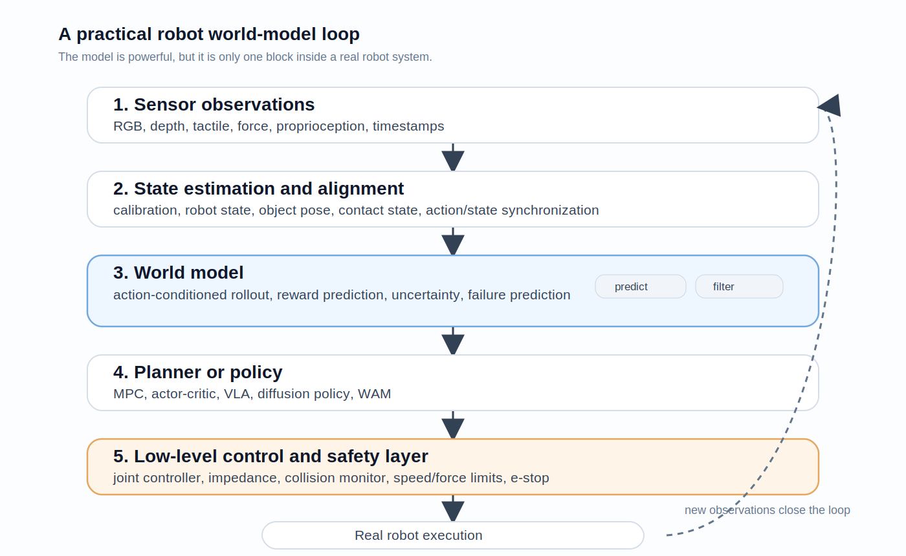
  <figcaption class="caption">真实机器人里，world model 通常不是单独“接管一切”，而是夹在状态估计、规划/policy、低层控制和安全层之间。图：本文绘制。</figcaption>
</figure>

```text
传感器观测
  RGB / depth / tactile / proprioception / force
        |
        v
状态估计与对齐
  calibration / robot state / object pose / contact state
        |
        v
world model
  action-conditioned rollout / uncertainty / reward prediction
        |
        v
planner 或 policy
  MPC / actor-critic / VLA / diffusion policy / WAM
        |
        v
低层控制与安全层
  impedance control / joint controller / collision monitor / e-stop
        |
        v
真实机器人执行
```

研究里经常把中间的 world model 单独拿出来讨论，但部署时真正难的是端到端闭环。比如模型预测“夹爪已经抓住杯子”，真实硬件里可能是夹爪力不够、杯壁打滑、深度相机被遮挡、末端执行器有 80ms 延迟。对模型来说这是一帧误差；对机器人来说任务已经失败。

### 10.2 三种落地方式

world model 不一定一上来就要直接控制机器人。更务实的落地方式有三种。

第一种是**旁路评估器**。真实 policy 照常执行，world model 在旁边预测未来，再和真实结果比较。这样不会因为模型错了直接伤机器人，但可以发现模型在哪些物体、动作和接触状态上不可靠。

第二种是**动作候选过滤器**。policy 或 planner 先提出多个候选动作，world model 预测这些动作的后果，把明显危险或不确定性很高的动作过滤掉。这比完全依赖 world model 控制更稳。

第三种才是**闭环规划器 / 训练环境**。world model 进入 MPC 或 imagined rollout，用于规划动作序列或训练 policy。这一步收益最大，但风险也最大，因为 policy 可能利用模型误差。

### 10.3 部署时最常见的坑

第一，**动作语义不一致**。仿真里一个 action 可能是理想关节目标，真机上却要经过控制器、限位、速度约束和电机响应。world model 如果用的是“理想动作”，policy 学到的动作不一定能被硬件真实执行。

第二，**时间延迟和异步传感器**。相机、力传感器、关节状态、控制命令往往不同步。world model 以为 `o_t` 和 `a_t` 是同一时刻，实际可能差了几十毫秒。对高速 locomotion 或接触 manipulation，这足够让预测失效。

第三，**接触状态不可见**。视觉里看起来接触了，不代表力已经传上去；视觉里看起来没动，不代表物体没有微滑。抓取、插孔、开门、折布、拧瓶盖这些任务都高度依赖不可见接触变量。

第四，**长时序漂移**。视频 world model 短 rollout 看起来很好，rollout 久了以后物体身份、几何关系、接触状态都会变形。表征空间预测、self-forcing、3D 表示和 diffusion distillation 都在缓解这个问题，但还没有完全解决。

第五，**policy 利用模型漏洞**。model-based RL 的老问题是：policy 会找到模型里高奖励但真实世界不成立的动作。比如在 learned simulator 里用奇怪的高频抖动获得奖励，真机上只会震坏电机或把物体弹飞。

第六，**不确定性没有进入控制决策**。很多 world model 会给出一个看似合理的未来，但不告诉 policy“这里我其实没见过”。真实部署必须让 uncertainty 参与规划：不确定就慢一点、换一个动作、请求人类介入，或者退回保守 controller。

第七，**安全不是 reward shaping 能完全解决的**。家庭和工厂里的机器人需要硬安全层：速度限制、力限制、碰撞检测、工作空间限制、急停、人工接管。world model 可以帮助预测风险，但不应该是唯一安全机制。

### 10.4 真机实验应该记录什么

很多机器人项目失败，不是因为模型不够大，而是因为日志不够完整。一个面向 world model 的真机数据包，至少应该包括：

- 多视角 RGB / depth，带时间戳。
- 机器人关节角、速度、电流或力矩。
- 末端执行器位姿、夹爪开合、控制模式。
- 动作命令和真正执行到的低层目标。
- reward、success label、failure label。
- reset 状态、人工接管、碰撞、急停。
- 相机内外参、机器人标定、物体或场景元数据。

如果只存一段视频和最后是否成功，后面很难训练 action-conditioned world model。真正有价值的是“动作导致了什么变化”，所以动作、时间戳和状态对齐比视频分辨率更重要。

### 10.5 真实部署怎么评测

真实部署不能只看 FVD 或重建 loss。更有意义的指标是：

- `one-step prediction error`：短期动力学是否对。
- `multi-step rollout error`：长程是否漂移。
- `contact event accuracy`：是否预测对接触、滑动、掉落、卡住。
- `uncertainty calibration`：高不确定是否真的对应高错误。
- `policy transfer gap`：模型里学到的策略到真机掉多少。
- `intervention rate`：每小时需要多少人工接管。
- `failure recovery rate`：失败中间态能否恢复。
- `latency`：从观测到动作是否满足控制频率。

world model 的评测最终必须和下游 agent performance 绑定。对机器人来说，好看的未来不等于可执行的未来。

---

## 11. 新手怎么入门：从代码、数据和实验开始

如果你是 fresh PhD，或者刚接触 world model，我建议不要从 Sora/Cosmos 这种大模型开始。它们方向重要，但对个人入门不友好：模型大、数据大、训练成本高，很多关键细节也不在开源代码里。

更好的入门顺序是：

```text
DreamerV3
  -> TD-MPC2
  -> DayDreamer
  -> 数据集与 VLA policy baseline
  -> 再看 DreamZero、Motus、DreamDojo 这类 WAM / foundation robot world model
```

### 11.1 路线一：经典 world model，从 DreamerV3 开始

**推荐 repo：** `danijar/dreamerv3`  
**地址：** <https://github.com/danijar/dreamerv3>

DreamerV3 是最适合入门 world model 的代码之一。它把核心概念都摆在明面上：encoder、RSSM、reward predictor、continue predictor、imagined rollout、actor-critic。你跑通它，就知道“先学世界、再在想象中学行为”到底是什么意思。

它的数据不是一个提前下载好的静态数据集，而是 agent 和环境交互生成的 replay buffer。也就是说，数据来自环境本身：Crafter、Atari、DMControl、Minecraft 等。对新手来说，这反而好，因为你可以从小环境开始，不必先处理机器人数据格式。

最小入门方式：

```bash
git clone https://github.com/danijar/dreamerv3.git
cd dreamerv3
pip install -U -r requirements.txt

python dreamerv3/main.py \
  --logdir ~/logdir/dreamer/debug \
  --configs crafter debug \
  --run.train_ratio 32
```

想看正常训练，可以去掉 `debug`，或者换成 README 里的任务：

```bash
python dreamerv3/main.py \
  --logdir ~/logdir/dreamer/crafter \
  --configs crafter \
  --run.train_ratio 32
```

结果看哪里：

```bash
pip install -U scope
python -m scope.viewer --basedir ~/logdir --port 8000
```

读代码时先看这些文件：

- `dreamerv3/main.py`：训练入口。
- `dreamerv3/agent.py`：world model、actor、critic 如何连接。
- `dreamerv3/configs.yaml`：不同环境的配置。
- `embodied/`：环境封装、replay、driver、logging。

建议做三个小实验：

1. 先跑 `debug`，确认流程通。
2. 改 `--jax.platform cpu` 或 batch size，理解算力瓶颈。
3. 记录一段 imagined rollout，对比真实 rollout，看模型什么时候开始漂。

### 11.2 路线二：控制友好的 world model，从 TD-MPC2 开始

**推荐 repo：** `nicklashansen/tdmpc2`  
**地址：** <https://github.com/nicklashansen/tdmpc2>

Dreamer 更像“完整 world model + policy learning 教科书”。TD-MPC2 更接近连续控制和机器人控制：它重视 latent dynamics、value prediction、MPC-style planning，以及跨任务、跨 embodiment 的可扩展性。

TD-MPC2 的数据有两种来源。单任务 online RL 时，数据来自环境交互；多任务 offline RL 时，repo 提供了 30-task 和 80-task 数据集、模型 checkpoints。任务覆盖 DMControl、Meta-World、ManiSkill2、MyoSuite，比较适合从仿真走向机器人。

安装可以用 Docker，也可以用 conda：

```bash
git clone https://github.com/nicklashansen/tdmpc2.git
cd tdmpc2
conda env create -f docker/environment.yaml
conda activate tdmpc2
```

先跑一个最小连续控制任务：

```bash
python train.py task=walker-walk steps=700000
```

如果想从图像观测开始：

```bash
python train.py task=walker-walk obs=rgb
```

如果要跑 ManiSkill2，需要额外下载 assets：

```bash
python -m mani_skill2.utils.download_asset all
export MS2_ASSET_DIR=<path>/<to>/<data>
```

读代码时建议看：

- `tdmpc2/agent/`：latent dynamics、policy、value 和 planning。
- `tdmpc2/envs/`：不同任务域怎么接入。
- `config.yaml`：任务、模型大小、训练步数、观测类型。
- `datasets/`：多任务 offline 训练相关入口。

建议做的实验：

1. `walker-walk` state observation 跑通。
2. 加 `obs=rgb`，比较像素输入和状态输入的难度。
3. 换 `task=dog-run` 或 `maniskill pick-cube`，看动作维度和接触任务如何影响稳定性。

### 11.3 路线三：真实机器人 world model，看 DayDreamer

**推荐 repo：** `danijar/daydreamer`  
**地址：** <https://github.com/danijar/daydreamer>

DayDreamer 很适合回答一个问题：world model 能不能真的在机器人上 online learning？它不是最现代的大模型路线，但非常经典，因为它把 Dreamer 搬到了 A1、XArm、UR5 等真实机器人上。

这个 repo 不适合作为第一天的跑分项目，更适合精读系统设计。它的关键不是某个 benchmark 分数，而是 actor process 和 learner process 如何并行：机器人一边采数据，一边把经验放进 replay buffer，learner 一边训练 world model 和 actor-critic。

README 里的结构是两个终端并行：

```bash
# learner
python embodied/agents/dreamerv2plus/train.py \
  --configs xarm \
  --run learning \
  --task xarm_dummy \
  --logdir ~/logdir/run1

# actor
python embodied/agents/dreamerv2plus/train.py \
  --configs xarm \
  --run acting \
  --task xarm_real \
  --env.kbreset True \
  --logdir ~/logdir/run1
```

这里的数据来自真实机器人交互，写入同一个 logdir/replay。新手如果没有机器人，不建议硬跑 `xarm_real`，而是读它怎么处理 reset、键盘接管、不同机器人配置和异步学习。

### 11.4 路线四：从 VLA baseline 走向 World Action Model

这里要特别小心：OpenVLA 不是 world model。它是 VLA policy，输入图像和语言，输出机器人动作。把 OpenVLA 放在这里，不是说它本身是 world model，而是因为它是理解 WAM 的一个好对照组。

区别可以写得很直接：

```text
World model: observation + action -> future observation/state
VLA:         observation + language -> action
WAM:         observation + language -> future observation + action
```

所以这一条路线真正关心的是 World Action Model：模型不只是预测动作，也预测动作之后世界会怎么变化。DreamZero、Motus、DreamDojo 这类工作就在往这个方向走。

但对新手来说，WAM 还没有 DreamerV3 那样稳定、经典、容易复现的标准代码入口。因此更实际的学习顺序是：

```text
先跑 VLA baseline，理解 observation-language-action 数据格式
再读 WAM 论文，理解 video-action joint modeling
最后自己做一个小型 WAM toy project
```

可以把 OpenVLA 当成 policy baseline 来跑，而不是当成 world model 来跑。

**VLA baseline repo：** `openvla/openvla`  
**地址：** <https://github.com/openvla/openvla>

OpenVLA 的数据主要来自 Open X-Embodiment / RLDS 格式数据。README 里示范了用 BridgeData V2 fine-tuning，数据下载后需要放在 base datasets dir 下，并命名为 `bridge_orig`：

```bash
cd <PATH TO BASE DATASETS DIR>
wget -r -nH --cut-dirs=4 --reject="index.html*" \
  https://rail.eecs.berkeley.edu/datasets/bridge_release/data/tfds/bridge_dataset/
mv bridge_dataset bridge_orig
```

训练入口是：

```bash
torchrun --standalone --nnodes 1 --nproc-per-node 8 vla-scripts/train.py \
  --pretrained_checkpoint <PATH_TO_CHECKPOINT> \
  --vla.type prism-dinosiglip-224px+mx-bridge \
  --data_root_dir <PATH_TO_BASE_DATASETS_DIR> \
  --run_root_dir <PATH_TO_LOG_DIR> \
  --image_aug True \
  --is_resume False
```

对新手来说，OpenVLA 最值得学的不是第一天就全量训练 7B 模型，而是：

- RLDS 数据格式怎么组织 observation、action、language。
- action tokenization 或 continuous action head 怎么设计。
- 多机器人数据如何做标准化。
- policy 为什么需要大量 expert demo，而 world model 为什么还需要失败和 play data。

一个好的 WAM 入门 project 可以是：

```text
在 ManiSkill 或 Meta-World 中，
先收集 random / scripted / failed trajectories，
训练一个 action-conditioned latent dynamics model，
再训练一个 policy head 预测 action，
最后比较：
  只预测 action 的 VLA / BC baseline
  只预测未来状态的 world model
  同时预测 future state + action 的小型 WAM
```

这个 project 不需要大模型，但会逼你碰到 WAM 最核心的问题：视频和动作如何对齐，future prediction 会不会帮助 policy，动作预测和世界预测会不会互相干扰。

---

## 12. 读完以后该怎么选方向

如果你是 fresh PhD，我不建议把“world model”当成一个单一方向来选。它更像一个交叉路口。你应该先判断自己更关心哪一个问题。

如果你来自强化学习，最自然的起点是 DreamerV3 和 TD-MPC2。先把 replay buffer、latent dynamics、imagined rollout、value learning、MPC 这些东西跑清楚。你的第一个问题可以是：怎样让模型里的策略训练更稳定、更少利用模型漏洞？

如果你来自机器人，最自然的起点是 ManiSkill / Meta-World / RLBench 加一个小型 action-conditioned dynamics model。不要一开始就上真实机器人。你的第一个问题可以是：模型预测误差、uncertainty 和真实任务失败之间有什么关系？

如果你来自计算机视觉或视频生成，最自然的起点是视频预测、latent action、inverse dynamics。你的第一个问题可以是：只看视频时，模型能不能学到足够可控的动作表征？

如果你来自多模态大模型或 VLA，最自然的起点是 OpenVLA / Open X-Embodiment，然后往 WAM 看。你的第一个问题可以是：future observation prediction 是否能帮助 action prediction 泛化到新物体、新场景、新 embodiment？

如果你来自系统或工业方向，最自然的起点不是训练最大模型，而是闭环评测、数据生成、sim-to-real、日志系统和安全过滤。你的第一个问题可以是：world model 在真实机器人栈里到底应该先作为评估器、过滤器，还是规划器？

一篇入门 tutorial 的目标不是让你立刻追上最前沿，而是让你知道自己站在哪条路上。对大多数新同学来说，最稳的第一步仍然是：

```text
小环境跑通 -> 看懂数据格式 -> 训练小 world model -> 做闭环评测 -> 再读 foundation-scale 工作
```

能走完这条小闭环，你就已经不只是“知道 world model 是什么”，而是开始真的进入这个方向了。

---

## 一个总结

world model 的核心不是视频生成，也不是 3D 生成，更不是某个新名字。

它真正关心的是：

```text
智能体能否在行动之前，预测行动的后果？
```

学术界从 model-based RL、Dreamer、MuZero、JEPA，一路走到 Genie、RWM、DreamDojo、DreamZero 和 Motus，是在寻找一种能服务决策的内部环境。工业界从 Cosmos、Genie、World Labs、自动驾驶仿真、机器人数据生成切入，是在寻找一种能规模化训练 physical AI 的基础设施。

短期看，world model 会先在数据生成、闭环评测、自动驾驶仿真、机器人 policy training 中落地。长期看，它可能会成为 agent 的“想象空间”：一个智能体不接触真实世界，也能在内部世界里计划、试错、学习和修正自己。

从这个角度看，world model 不是让 AI 从“数字原住民”变成“物理世界参与者”的全部答案，但它很可能是最关键的一块拼图。

---

## 术语表

| 术语 | 全称 / 英文 | 简要解释 | 常见语境 |
|---|---|---|---|
| WM | World Model | 能预测未来状态的模型；狭义上通常指 action-conditioned dynamics model。 | RL、机器人、自动驾驶 |
| WFM | World Foundation Model | 面向物理世界的大规模基础模型，支持视频预测、可控生成、评估、数据生成等多个下游任务。 | Cosmos、Genie、Marble |
| WAM | World Action Model | 同时建模未来世界状态和未来动作的模型，把 simulator 与 policy 合并到统一框架。 | DreamZero、Motus |
| VGM | Video Generation Model | 输入文本、图像或历史视频，生成未来视频；不一定吃动作。 | Sora、Veo、Cosmos Predict |
| VLA | Vision-Language-Action Model | 输入视觉观测和语言指令，直接输出机器人动作。 | RT-2、OpenVLA、π0、GR00T |
| IDM | Inverse Dynamics Model | 根据当前状态和未来状态反推动作。 | video-to-action、UniPi |
| Dynamics Model | 动力学模型 | 根据当前状态和动作预测下一状态，是狭义 world model 的核心。 | MBRL、机器人控制 |
| Forward Model | 前向模型 | 与 dynamics model 基本同义，强调从 action 推未来结果。 | 控制、规划 |
| Policy | 策略 | 从状态或观测映射到动作的模型。 | RL、VLA、机器人 |
| Model-Based RL | MBRL | 先学习环境模型，再利用模型做规划或策略训练。 | Dreamer、PlaNet、TD-MPC |
| Model-Free RL | MFRL | 不显式学习环境模型，直接从交互数据学习 policy 或 value。 | PPO、SAC、DQN |
| MPC | Model Predictive Control | 用模型向前滚动多个候选动作序列，选回报最高的一段执行。 | PlaNet、TD-MPC、机器人控制 |
| RSSM | Recurrent State-Space Model | Dreamer/PlaNet 的核心结构，把 deterministic hidden state 和 stochastic latent state 结合起来。 | latent dynamics |
| Latent State | 潜在状态 | 模型内部压缩后的状态表示，不一定能被人直接解释。 | Dreamer、MuZero、JEPA |
| Latent Action | 潜在动作 | 从无动作标签视频中自监督学出来的动作表示，用来解释帧间变化。 | Genie、DreamDojo、Motus |
| JEPA | Joint-Embedding Predictive Architecture | 不重建像素，而是在表征空间预测未来或被遮挡部分。 | I-JEPA、V-JEPA 2 |
| Tokenization | 标记化 | 把图像、视频或动作离散/压缩成 token，方便 Transformer 建模。 | IRIS、视频生成 |
| VQ-VAE | Vector Quantized VAE | 把连续图像特征离散成 codebook token 的自编码器。 | IRIS、VideoGPT |
| Diffusion | 扩散模型 | 从噪声逐步去噪生成样本，适合连续图像、视频和动作分布。 | Sora、DIAMOND、Cosmos |
| AR | Autoregressive | 自回归建模，用过去预测下一步，再把预测结果继续作为上下文。 | 视频 rollout、语言模型 |
| AR + Diffusion | 自回归扩散 | 时间上逐步 rollout，每一步内部用 diffusion 生成连续状态。 | Genie、IWS、Motus |
| Consistency Model | 一致性模型 | 用较少去噪步数实现快速生成或预测，常用于加速 diffusion。 | Interactive World Simulator |
| Self-Forcing | 自强迫训练 | 训练时让模型用自己的预测继续 rollout，多步都和真实状态算 loss，缓解长程漂移。 | RWM |
| Uncertainty Ensemble | 集成不确定性 | 用多个预测头或多个模型估计分歧，分歧大表示模型不可靠。 | RWM-U、安全 RL |
| Epistemic Uncertainty | 认知不确定性 | 由于数据不足或分布外输入导致的不确定性。 | uncertainty-aware policy |
| Hallucination | 幻觉 | world model 在没数据或不可靠区域生成看似合理但物理错误的预测。 | 模型 rollout、policy training |
| Model Exploitation | 模型漏洞利用 | policy 在 learned model 中找到高奖励但真实世界无效的动作。 | MBRL 风险 |
| Rollout | 展开 / 滚动预测 | 从当前状态开始，连续预测多步未来。 | planning、evaluation |
| Long-Horizon Drift | 长程漂移 | 多步预测后物体身份、空间关系或物理状态逐渐失真。 | 视频 WM |
| Counterfactual | 反事实 | 比较不同动作会导致什么不同未来。 | planning、安全评估 |
| Closed-Loop Evaluation | 闭环评测 | policy 的动作会影响下一状态，模型持续反馈，而不是只做离线单步预测。 | 自动驾驶、机器人 |
| Open-Loop Evaluation | 开环评测 | 固定真实历史轨迹，只评估模型预测是否接近数据，不让 policy 影响环境。 | 视频预测、离线评测 |
| FVD | Fréchet Video Distance | 常用视频生成质量指标，但不足以评价物理正确性和控制可用性。 | 视频模型评测 |
| Sim-to-Real | 仿真到真实 | 在仿真或模型中训练，再迁移到真实机器人或真实道路。 | Isaac、Genesis、机器人 |
| Domain Randomization | 域随机化 | 随机改变纹理、光照、物体、动力学参数等，让策略更容易迁移真实世界。 | sim-to-real |
| Play Data | 探索数据 | 包含成功、失败、随机探索、多样动作的数据，比干净专家轨迹更适合训练 world model。 | 机器人数据 |
| Expert Demo | 专家示范 | 成功、干净、任务导向的数据，更适合 imitation learning。 | VLA、BC |
| Egocentric Video | 第一视角视频 | 从人类头戴或胸前视角采集的视频，规模大且接近具身交互。 | Ego4D、DreamDojo |
| Embodiment | 机体形态 | 智能体的身体结构和动作空间，如人形、四足、机械臂、夹爪。 | 机器人泛化 |
| Proprioception | 本体感知 | 机器人自身关节角、速度、力矩、IMU 等内部状态。 | 机器人控制 |
| Haptics / Tactile | 触觉 / 力反馈 | 接触力、压力、滑动等触觉信息，是当前视觉 world model 的短板。 | manipulation |
| Occupancy | 占据表示 | 用 voxel 或 BEV 网格表示空间中哪些位置被物体占据。 | 自动驾驶、OccWorld |
| BEV | Bird's-Eye View | 鸟瞰视角表示，自动驾驶中常用于融合多摄像头和地图信息。 | DriveDreamer、planner |
| 3DGS | 3D Gaussian Splatting | 用三维高斯表示场景并快速渲染新视角。 | 3D world model |
| NeRF | Neural Radiance Field | 用神经网络表示三维场景和视角相关颜色/密度。 | 3D 重建 |
| Digital Twin | 数字孪生 | 真实场景或系统的可仿真数字副本。 | 工业仿真、自动驾驶 |

---

## References

### 经典与 model-based RL

- Ha, D. and Schmidhuber, J. *World Models*. 2018. <https://worldmodels.github.io>
- Hafner, D. *DreamerV3 codebase*. <https://github.com/danijar/dreamerv3>
- Hafner, D. et al. *Learning Latent Dynamics for Planning from Pixels* (PlaNet). ICML 2019.
- Hafner, D. et al. *Dream to Control: Learning Behaviors by Latent Imagination*. ICLR 2020.
- Hafner, D. et al. *Mastering Atari with Discrete World Models*. ICLR 2021.
- Hafner, D. et al. *Mastering Diverse Domains through World Models* (Dreamer V3).
- Schrittwieser, J. et al. *Mastering Atari, Go, Chess and Shogi by Planning with a Learned Model* (MuZero). Nature 2020.
- Hansen, N. et al. *TD-MPC2: Scalable, Robust World Models for Continuous Control*.
- Hansen, N. *TD-MPC2 codebase*. <https://github.com/nicklashansen/tdmpc2>

### 视频、交互世界与 world foundation models

- Google DeepMind. *Genie: Generative Interactive Environments*. 2024. <https://deepmind.google/research/publications/genie-generative-interactive-environments/>
- Google DeepMind. *Genie 2: A large-scale foundation world model*. 2024. <https://deepmind.google/blog/genie-2-a-large-scale-foundation-world-model/>
- Google DeepMind. *Genie 3: A new frontier for world models*. 2025. <https://deepmind.google/discover/blog/genie-3-a-new-frontier-for-world-models/>
- NVIDIA. *Cosmos World Foundation Models*. 2025. <https://www.nvidia.com/en-us/ai/cosmos/>
- NVIDIA Blog. *NVIDIA Makes Cosmos World Foundation Models Openly Available to Physical AI Developer Community*. 2025. <https://blogs.nvidia.com/blog/cosmos-world-foundation-models/>
- World Labs. *Marble: A Multimodal World Model*. 2025. <https://www.worldlabs.ai/blog/marble-world-model>
- Yang, M. et al. *Learning Interactive Real-World Simulators* (UniSim). ICLR 2024.
- Alonso, E. et al. *Diffusion for World Modeling* (DIAMOND). NeurIPS 2024.

### JEPA 与表征预测

- LeCun, Y. *A Path Towards Autonomous Machine Intelligence*. 2022.
- Assran, M. et al. *Self-Supervised Learning from Images with a Joint-Embedding Predictive Architecture* (I-JEPA). CVPR 2023.
- Bardes, A. et al. *V-JEPA: Revisiting Feature Prediction for Learning Visual Representations from Video*.
- Meta AI. *Introducing the V-JEPA 2 world model and new benchmarks for physical reasoning*. 2025. <https://ai.meta.com/blog/v-jepa-2-world-model-benchmarks/>

### 机器人与具身智能

- Wu, P. et al. *DayDreamer: World Models for Physical Robot Learning*. CoRL 2022.
- Hafner, D. *DayDreamer codebase*. <https://github.com/danijar/daydreamer>
- Du, Y. et al. *Learning Universal Policies via Text-Guided Video Generation* (UniPi).
- Li, C. et al. *Robotic World Model: A Neural Network Simulator for Robust Policy Optimization in Robotics*. <https://sites.google.com/view/roboticworldmodel/home>
- Li, C. et al. *Uncertainty-Aware Robotic World Model*. <https://sites.google.com/view/uncertainty-aware-rwm/home>
- Wang, Y. et al. *Learning Interactive Real-World Simulators for Robot Policy Training and Evaluation*. <https://www.yixuanwang.me/interactive_world_sim/>
- Kim, M. J. et al. *OpenVLA: An Open-Source Vision-Language-Action Model*. <https://github.com/openvla/openvla>
- Motus Team. *Motus: A Unified World Action Model for Robotic Manipulation*. 2026. <https://motus-robotics.github.io/motus>
- Gao, S. et al. *DreamDojo: A Generalist Robot World Model from Large-Scale Human Videos*. 2026. <https://arxiv.org/abs/2602.06949>
- Gao, S. et al. *DreamZero: World Action Models are Zero-Shot Policies*. 2026. <https://arxiv.org/abs/2602.15922>
- 1X Technologies. *1X World Model*. 2025.
- NVIDIA. *Isaac GR00T / GR00T-Dreams*. <https://github.com/NVIDIA/Isaac-GR00T>
- Open X-Embodiment Collaboration. *Open X-Embodiment dataset*. <https://robotics-transformer-x.github.io>
- BridgeData V2. <https://rail.eecs.berkeley.edu/datasets/bridge_release/>
- D4RL: Datasets for Deep Data-Driven Reinforcement Learning. <https://github.com/Farama-Foundation/D4RL>
- Meta-World benchmark. <https://github.com/Farama-Foundation/Metaworld>
- ManiSkill benchmark. <https://github.com/haosulab/ManiSkill>
- RLBench benchmark. <https://github.com/stepjam/RLBench>
- Ego4D dataset. <https://ego4d-data.org>
- Ego-Exo4D dataset. <https://docs.ego-exo4d-data.org>
- EPIC-KITCHENS dataset. <https://epic-kitchens.github.io>
- Something-Something dataset. <https://developer.qualcomm.com/software/ai-datasets/something-something>
- DeepMind. *Open sourcing Kinetics-700*. <https://deepmind.google/discover/blog/open-sourcing-kinetics-700/>

### 自动驾驶与 3D 世界

- Wayve. *GAIA-1 / GAIA-2*.
- DriveDreamer / MagicDrive / OccWorld / Vista 系列工作。
- World Labs Docs. *Marble Models*. <https://docs.worldlabs.ai/marble/models>

### 延伸阅读

- World-Model-Papers: <https://github.com/Timothyxxx/World-Model-Papers>
- Awesome Video Diffusion: <https://github.com/showlab/Awesome-Video-Diffusion>
- Embodied AI Reading List: <https://yenchenlin.me/embodied-reading-list>
